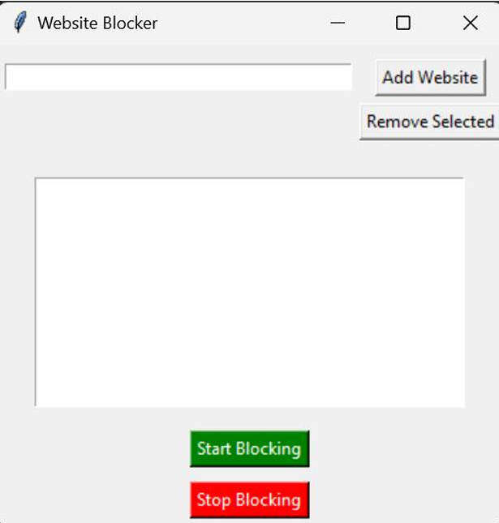
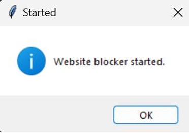
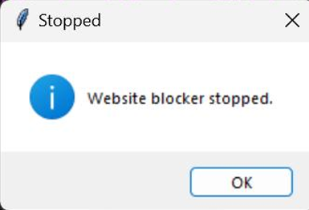

# Python Website Blocker

## Overview

A Python-based Website Blocker designed to improve productivity by restricting access to selected websites during specified time periods.

The application provides a graphical user interface (GUI) for managing blocked websites and automatically modifies the system hosts file to enforce restrictions.

### Main Application Interface



The GUI allows users to:

* Add websites to the block list
* Remove websites from the block list
* Start website blocking
* Stop website blocking

---

## Features

* GUI built with Tkinter
* Add websites dynamically
* Remove websites dynamically
* Time-based website blocking
* Automatic unblocking
* Multi-threaded background monitoring
* Windows executable deployment support

---

## Technologies Used

* Python
* Tkinter
* Threading
* Datetime
* Hosts File Manipulation

---

## How It Works

### Step 1: Add Websites

Users can add websites that should be blocked during restricted periods.

### Step 2: Start Blocking

When blocking is activated, the application updates the system hosts file and redirects selected websites to localhost.



---

### Step 3: Stop Blocking

When blocking is disabled, the application removes the restrictions and restores normal access.



---

## Project Structure

```text
Python-Website-Blocker/
├── website_blocker.py
├── README.md
├── requirements.txt
├── screenshots/
└── docs/
```

---

## Learning Outcomes

* Python Programming
* GUI Development
* Multi-threading
* File Handling
* Operating System Concepts
* Basic Security Controls

---

## Author

Nishmanul Haq
